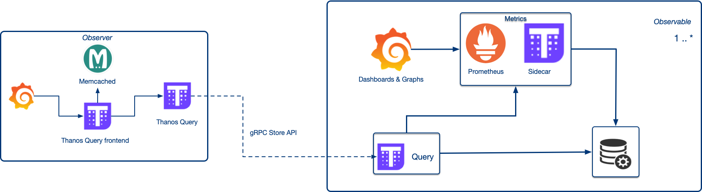

# thanos-observer
A docker-compose based environment to setup a thanos stack observing a remote cluster.
It provisions following containers:
* grafana
* promtheus datasource linked to thanos query frontend
* query frontend
* memcached linked to the query frontend
* thanos query using remote k8s cluster gRPC endpoint and leveraging mTLS for authentication.

Here is an example [kubernetes-monitoring](https://github.com/nickytd/kubernetes-monitoring) for exposing k8s Thanos Query StoreAPI endpoint 
